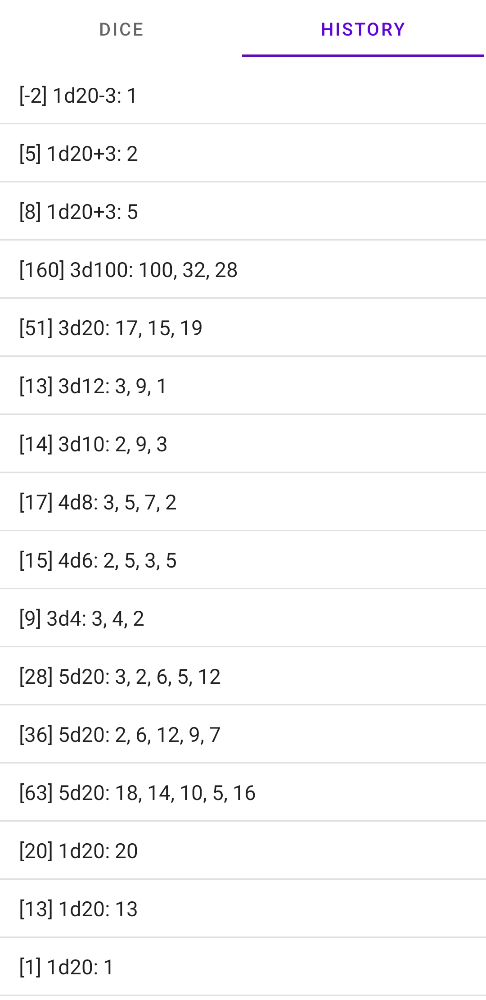

<h1><b> RPG Dice </b></h1>

 CSCI 3420 Fall 2021 Project

<b><u>Group Members:</u></b>
<ul>
    <li><a href="https://github.com/ahall1315" target="_blank">ahall1315</a></li>
    <li>Ethan H.</li>
    <li><a href="https://github.com/BMcclammy99" target="_blank">BMcclammy99</a></li>
    <li><a href="https://github.com/Supersystem473" target="_blank">Supersystem473</a></li>
</ul>

<h2><b><u>Description:</u></b></h2>

<b>About</b>

RPG Dice is a dice rolling Android app for roleplaying games. 

RPG Dice was also a group project in Distributed and Mobile Systems at Augusta University.

<b>Features</b>

<ul>
    <li>Dice: d4, d6, d8, d10, d12, d20, and d100</li>
    <li>Roll multiple dice at once (1 to 100)</li>
    <li>Add a modifier to dice rolls (-100 to +100)</li>
    <li>History</li>
    <li>Shake to roll dice</li>
</ul>

 
 

